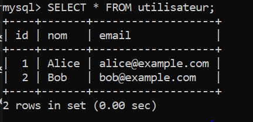

# TP MySQL – Lab 1

## Objectif

Ce TP a pour objectif de :

* Installer et configurer MySQL sur Windows
* Créer une base de données et une table
* Insérer et interroger des données
* Exporter une table avec `mysqldump`
* Fournir les livrables demandés

---

## Environnement

* Système d’exploitation : **Windows**
* SGBD : **MySQL Server 8.0**
* Outil : **CLI MySQL (mysql.exe)**

---

## Étapes réalisées

### 1. Démarrage et connexion à MySQL

Connexion au serveur MySQL via la ligne de commande :

```bash
mysql -u root -p
```

### 2. Création de la base de données

```sql
CREATE DATABASE testdb
  CHARACTER SET utf8mb4
  COLLATE utf8mb4_unicode_ci;
USE testdb;
```

### 3. Création de la table

```sql
CREATE TABLE utilisateur (
  id    INT AUTO_INCREMENT PRIMARY KEY,
  nom   VARCHAR(50) NOT NULL,
  email VARCHAR(100) NOT NULL UNIQUE
) ENGINE=InnoDB;
```

### 4. Insertion des données

```sql
INSERT INTO utilisateur (nom, email) VALUES
  ('Alice', 'alice@example.com'),
  ('Bob',   'bob@example.com');
```

### 5. Requêtes SQL

Afficher tous les utilisateurs :

```sql
SELECT * FROM utilisateur;
```

Rechercher les emails se terminant par `@example.com` :

```sql
SELECT nom, email
FROM utilisateur
WHERE email LIKE '%@example.com';
```

Compter le nombre d'enregistrements :

```sql
SELECT COUNT(*) AS total
FROM utilisateur;
```

---

## 6. Capture d’écran de la commande `SELECT * FROM utilisateur;`



> L’image doit être dans le même dossier que ce README pour s’afficher correctement.

---

## 7. Export de la table

```bash
mysqldump -u root -p testdb utilisateur > utilisateur_dump.sql
```

---

## Livrables fournis

* `lab1_setup.sql` : toutes les commandes SQL utilisées
* `utilisateur_dump.sql` : dump de la table utilisateur
* `capture_select_utilisateur.png` : capture d’écran du résultat


---

## Auteur

* Nom : AYA AIT EL HARCH 
* Cours: Bases de données
* Encadré par : Pr.Mohamed LACHGAR
